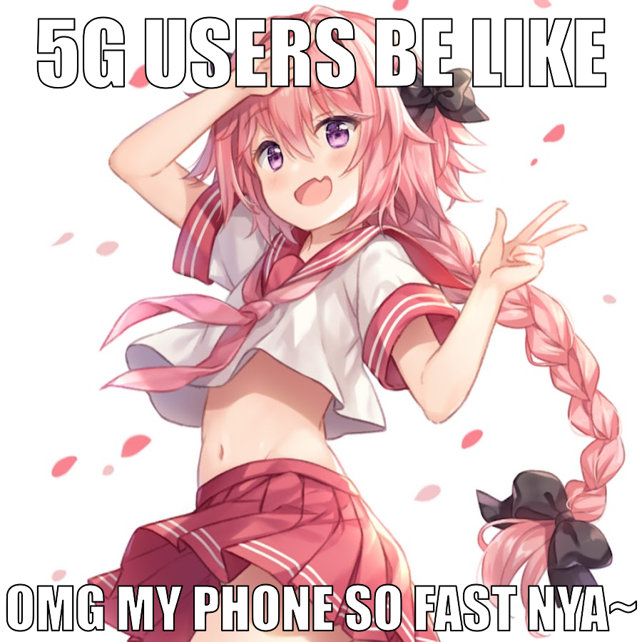

# memegen

A POSIX shell script to generate memes from the commandline using ImageMagick

## Requirements

- ImageMagick installed
- Impact font installed properly. Check: `convert -list font | grep Impact`

## Usage

```
memegen <INPUT_FILE> <OUTPUT_FILE> [TOP_CAPTION] [BOTTOM_CAPTION]

  - INPUT_FILE: Full or absolute path to a local file. Or alternatively an image url (will be downloaded to /tmp/memetemp using curl)
  - OUTPUT_FILE: Full or absolute path to save file to. Will not override if file exists
  - TOP_CAPTION: Top caption. Only one of TOP_CAPTION and BOTTOM_CAPTION is required
  - BOTTOM_CAPTION: Bottom caption
```

## Example

```sh
$ memegen https://i.imgur.com/Yu6kZc5.jpg 5g.jpg "5g users be like" "omg my phone so fast nya~"
Done! Saved to 5g.jpg
```

Results in:

